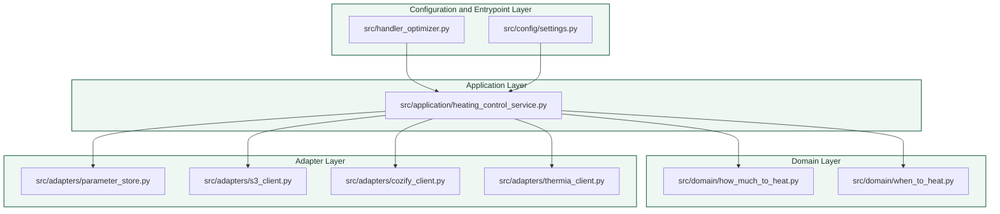
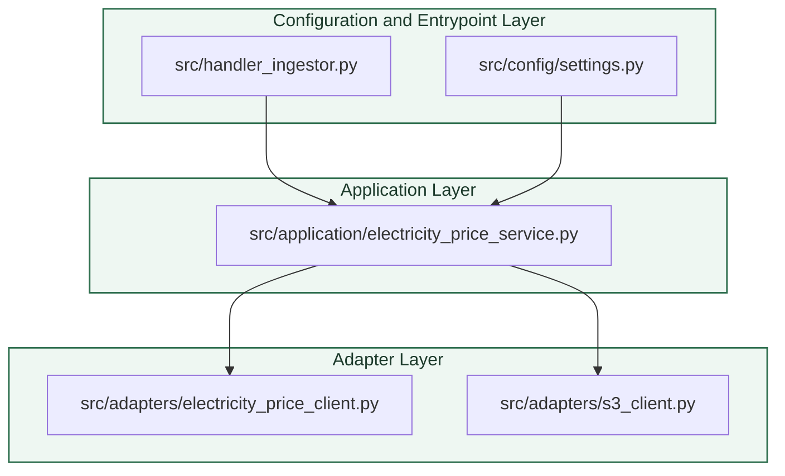

# Layered Architecture Diagram

The project now has two separate Lambda flows. The optimizer decides whether to heat and updates the Thermia controls, while the ingestor only fetches and stores spot prices.

## Optimizer Lambda

## Ingestor Lambda

